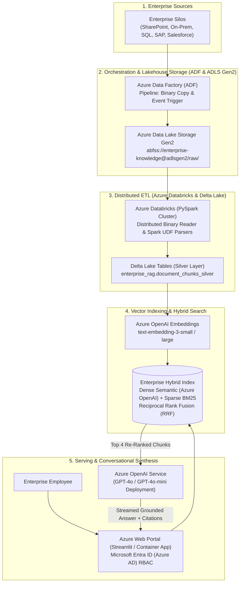

# 🔷 Azure OpenAI + ADF + Databricks Enterprise Knowledge Hub

A production-grade, enterprise-scale **Retrieval-Augmented Generation (RAG)** platform designed for multi-terabyte heterogeneous knowledge bases on **Microsoft Azure**, integrating **Azure Data Factory (ADF)**, **Azure Databricks (PySpark + Delta Lake)**, **Azure Data Lake Storage Gen2 (ADLS Gen2)**, **Azure OpenAI Service (GPT-4o)**, and **LangChain**.

---

## 🏛️ Enterprise Architecture Diagram



---

## 🌟 Architectural Pillars

### 1. 📥 Azure Data Factory (ADF) Orchestration
* Automated copy activities move files from multi-cloud and on-prem repositories into ADLS Gen2.
* Linked services connect securely using **Azure Key Vault** and **Managed Identities**.
* Sample ADF ARM/JSON pipeline included at [adf_pipelines/pipeline_copy_to_adls.json](adf_pipelines/pipeline_copy_to_adls.json).

### 2. ⚡ Azure Databricks Distributed Processing (PySpark & Delta Lake)
* Handles multi-terabyte data volume that cannot be processed in-memory or on single machines.
* Reads binary files in parallel across auto-scaling worker nodes (`Standard_E8ds_v5`).
* Distributed chunking and schema normalization writing to Delta Lake tables.
* Production PySpark Databricks notebook included at [databricks_jobs/pyspark_etl_chunking.py](databricks_jobs/pyspark_etl_chunking.py).

### 3. 📑 Heterogeneous Multi-Format Ingestion
* **📄 PDFs**: Page-level extraction, table detection, and layout preservation (`pypdf`).
* **🌲 Complex Nested JSON / JSONL**: Schema unwinding, recursive flattening, and semantic entity generation.
* **📑 Hierarchical XML**: XML tree traversal, attribute extraction, and transactional record chunking.
* **📊 Tabular CSV / TSV**: Header-preserving markdown table batching.
* **📝 Markdown & Plain Text**: Heading-aware section splitting (`#`, `##`, `###`).

### 4. 🔍 Hybrid Dense + Sparse Search with RRF
* **Dense Vectors**: Azure OpenAI `text-embedding-3-small` (or standard OpenAI embeddings) with local fallback.
* **Sparse Lexical Search**: BM25 token inverted index for exact keyword, acronym, and transaction ID matching.
* **Reciprocal Rank Fusion (RRF)**: Merges semantic and keyword ranks:
  $$RRF(d) = \frac{0.65}{60 + rank_{dense}} + \frac{0.35}{60 + rank_{sparse}}$$
* **Cross-Encoder Re-Ranking**: Filters candidates down to top 4 highest-confidence chunks for the prompt.

### 5. 🔐 Microsoft Entra ID (Azure AD) Role-Based Access Control (RBAC)
* Chunks are tagged with `allowed_roles` (e.g., `["engineering"]`, `["legal"]`, `["finance"]`, `["executive"]`, `["all"]`).
* At query time, the search engine enforces security boundaries before similarity scoring.

---

## 📁 Repository Layout

```
openai-langchain-enterprise-knowledge-hub/
├── app.py                  # Streamlit Enterprise Portal (Entra ID RBAC, ADLS Sync, Citations)
├── rag_pipeline.py         # Azure OpenAI (GPT-4o) conversational orchestrator
├── cli.py                  # Terminal interactive assistant with Entra ID switching
├── ingest.py               # Batch folder ingestion utility
├── config.py               # Azure OpenAI, ADLS Gen2, and RAG configuration
├── Dockerfile              # Azure Container Apps / App Service container spec
├── requirements.txt        # Pinned dependencies
├── adf_pipelines/          # Azure Data Factory pipeline definitions
│   └── pipeline_copy_to_adls.json
├── databricks_jobs/        # Distributed PySpark Databricks ETL jobs
│   └── pyspark_etl_chunking.py
├── indexing/               # Hybrid index (Dense + BM25 + RRF + RBAC + Re-ranker)
│   ├── __init__.py
│   └── hybrid_index.py
├── parsers/                # Multi-format enterprise parsers
│   ├── base.py
│   ├── factory.py
│   ├── pdf_parser.py
│   ├── json_parser.py
│   ├── xml_parser.py
│   ├── csv_parser.py
│   └── text_parser.py
├── utils/                  # Azure authentication & ADLS Gen2 storage connectors
│   ├── __init__.py
│   ├── auth.py
│   └── azure_storage.py
└── sample_data/            # Sample enterprise data
    ├── azure_cloud_architecture.json
    ├── banking_ledger_audit.xml
    ├── azure_master_services_agreement.txt
    ├── azure_sre_failover_runbook.md
    └── entra_id_employee_directory.csv
```

---

## 🚀 Quick Start

### 1. Environment Setup

```bash
cd openai-langchain-enterprise-knowledge-hub
python3 -m venv .venv
source .venv/bin/activate
pip install -r requirements.txt
```

### 2. Configure Environment

Copy `.env.example` to `.env`:
```bash
cp .env.example .env
```

Configure your Azure OpenAI credentials (or standard OpenAI key):
```env
# Azure OpenAI
AZURE_OPENAI_ENDPOINT=https://your-resource.openai.azure.com/
AZURE_OPENAI_API_KEY=your-azure-key
AZURE_OPENAI_CHAT_DEPLOYMENT=gpt-4o
AZURE_OPENAI_EMBEDDING_DEPLOYMENT=text-embedding-3-small

# Azure Storage / ADLS Gen2 (Optional)
AZURE_STORAGE_CONTAINER=enterprise-knowledge-corpus
```

### 3. Run the Web Knowledge Portal

```bash
.venv/bin/streamlit run app.py --server.port=8504
```
Open **`http://localhost:8504`**:
1. Select an **Active Employee Role** (e.g. `Engineering`, `Corporate Legal`, `Finance`).
2. Click **⚡ Ingest Sample Corpus** to load sample Azure JSON, XML, MD, and CSV files in seconds.
3. Test suggested role-based queries or upload custom documents with automatic ADLS Gen2 synchronization!

### 4. Run Batch Ingestion & Terminal CLI

```bash
# Ingest directory of documents
.venv/bin/python ingest.py sample_data/

# Run interactive terminal Q&A
.venv/bin/python cli.py
```

---

## 🚢 Deploying to Azure Container Apps

Deploy as a serverless container on Microsoft Azure:

```bash
# Build and push to Azure Container Registry (ACR)
az acr build --registry myregistry --image enterprise-rag:latest .

# Deploy to Azure Container Apps
az containerapp create \
  --name enterprise-rag-hub \
  --resource-group rg-enterprise-ai-prod \
  --environment my-container-env \
  --image myregistry.azurecr.io/enterprise-rag:latest \
  --target-port 8080 \
  --ingress external \
  --min-replicas 1 \
  --max-replicas 10 \
  --cpu 2.0 --memory 4.0Gi
```
